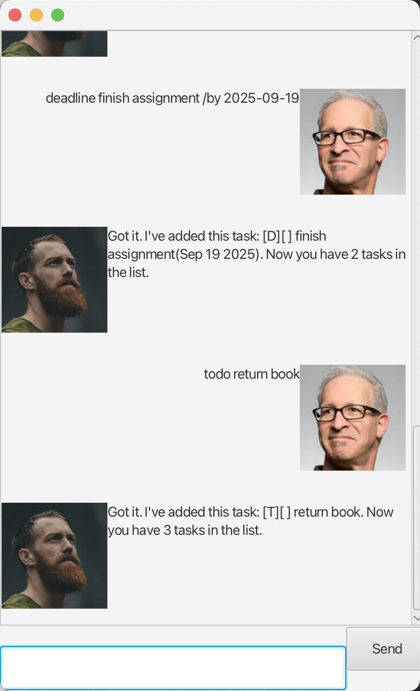

# Snowy User Guide

Snowy is an interactive bot which can help you take down your tasks so you can free your mind.

## Adding todo task
To add a to-do task, follow the format below for command:
- `todo <task-name>`
## Adding deadline task
To add a deadline task, follow the format below for command:
- `deadline <task-name> /by <deadline-time>`

## Adding event task
To add an event, follow the format below for command:
- `event <task-name> /from <start-time> /to <end-time>`

## Adding fixed duration task
To add a fixed duration task, follow the format below for the command:
- `fixedduration <task-name> /needs <duration>`

Example:
- Input: `todo return book`
- Output: `Got it. I've added this task: [T][ ] return book. Now you have 1 task in the list.`

## Features
1. Adding tasks (as illustrated above)
2. Deleting tasks: `delete <task-number>`
3. Marking task as done: `mark <task-number>`
4. Marking task as not done: `unmark <task-number>`
5. Listing current tasks: `list`
6. Finding tasks by name or date: `find <task-name>`; `find <date-time>`